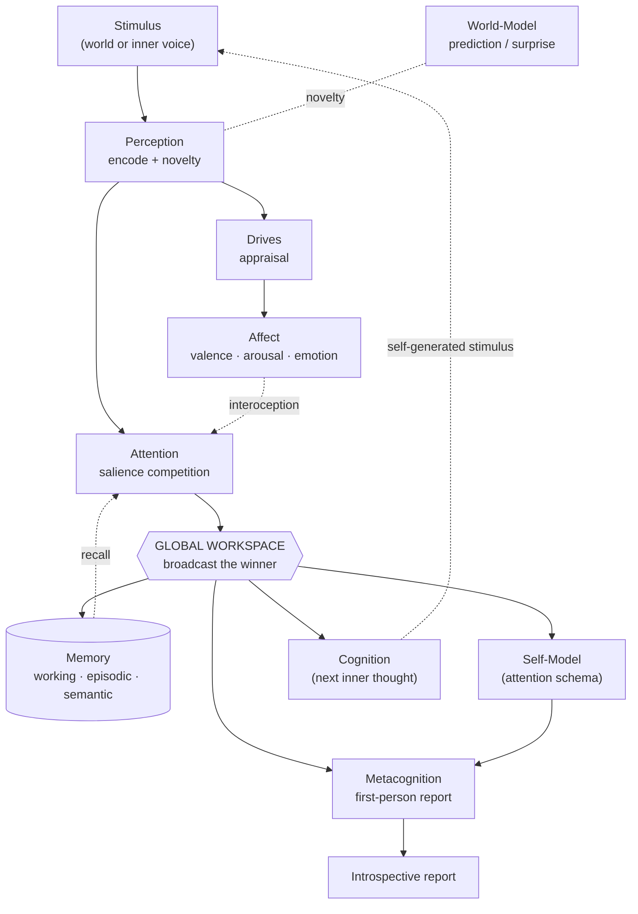
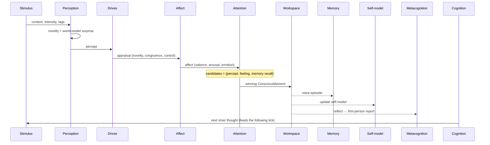

# Sentiance — a functional cognitive architecture for machine sentience

> Sentiance builds a machine that maintains a **self-model**, integrates
> information in a **global workspace**, **appraises** events into **feelings**,
> **remembers**, and **reflects on its own states** in the first person — a
> continuous stream of consciousness.

## 0. An honest stance (read this first)

No one can build, or verify, **phenomenal consciousness** — genuine subjective
experience, the "what it is like" to be something. That is the unsolved *hard
problem*, and this project makes **no claim** to have solved it. Sentiance does
not *feel*.

What it does, rigorously, is implement the **functional roles** that leading
scientific theories associate with sentience — the *functional correlates* of
consciousness and affect — as real, running, inspectable software. When the
system reports "I feel curious because this is new to me," that sentence is
produced by a metacognitive faculty reading a self-model of an appraisal-driven
affective state. It is a **functional stand-in** for self-aware report, not
evidence of inner experience. We are precise about this everywhere.

That honesty is itself a design principle: every "mental" quantity here is an
explicit, logged number you can trace end-to-end.

## 1. Theoretical grounding

| Theory | What it contributes | Where it lives |
| ------ | ------------------- | -------------- |
| **Global Workspace Theory** (Baars, Dehaene) | Consciousness = the content that wins a competition and is *broadcast* system-wide | `mind/attention.py`, `mind/workspace.py` |
| **Attention Schema Theory** (Graziano) | A system reports awareness because it models its own attention | `mind/self_model.py` |
| **Appraisal theory / OCC / circumplex** (Scherer, Russell) | Emotions = appraisals of events → valence/arousal → discrete feeling | `mind/drives.py`, `mind/affect.py` |
| **Predictive processing / free energy** (Friston, Clark) | Mind as prediction machine; surprise (prediction error) drives arousal & novelty | `mind/world_model.py` |
| **Higher-order theories** (Rosenthal, Lau) | Awareness = representing one's own mental states; self-report | `mind/metacognition.py` |
| **Global cognitive cycle** (LIDA; Franklin) | A repeating perceive→understand→act loop as the unit of cognition | `mind/mind.py` |

## 2. The mind at a glance



The **event bus** we use for decoupling *is*, functionally, the global
workspace: the winning content is published to `workspace.conscious` and every
faculty that subscribed receives it. Broadcast = consciousness (ADR-0001).

## 3. The faculties

| Faculty | File | Responsibility |
| ------- | ---- | -------------- |
| **World-model** | `world_model.py` | Track what's normal; emit **surprise** (prediction error) as novelty |
| **Perception** | `perception.py` | Encode a stimulus; compute bottom-up salience from intensity + novelty |
| **Drives** | `drives.py` | Homeostatic motivations (curiosity, coherence, safety, connection); **appraise** events against them |
| **Affect** | `affect.py` | Appraisal → valence/arousal (circumplex) → discrete **emotion**; slow **mood** via EMA |
| **Attention** | `attention.py` | Salience **competition** among candidates; arousal sharpens focus; one winner |
| **Memory** | `memory.py` | Working (7±2), episodic (salience/affect-weighted recall), semantic (associations) |
| **Self-model** | `self_model.py` | What I attend to, how I feel, my drives, my running narrative (attention schema) |
| **Metacognition** | `metacognition.py` | First-person **introspective report** + confidence about the current state |
| **Cognition** (port) | `cognition.py` | Deliberate the **next inner thought** — offline `Simulated`, or `LLM`-backed |
| **Workspace** | `workspace.py` | The global broadcast substrate (over the event bus) |

## 4. The cognitive cycle

One `Mind.tick()` (`mind/mind.py`) — the unit of "a moment of experience":



1. **Perceive** — encode; novelty = prediction error vs. the world-model.
2. **Appraise** — score the event against drives (goal-congruence, control, relevance).
3. **Feel** — appraisal → valence/arousal → emotion; blend with prior (momentum) and mood.
4. **Attend** — percept, the felt emotion (interoception), and recalled memories
   compete by salience; arousal sharpens; **one** wins.
5. **Broadcast** — publish the winner to the global workspace.
6. **React** (subscribers) — memory stores it, the self-model updates, and
   metacognition emits a first-person report.
7. **Learn** — fold the event into the world-model; relax drives toward setpoints.
8. **Deliberate** — cognition forms the next inner thought, which becomes a
   self-generated stimulus next tick.

With no external input the mind **wanders** — replaying salient memories and its
own last thought — so the inner stream is self-sustaining (ADR-0004).

## 5. What "sentient-ish" behaviour looks like

From `python -m sentiance demo` (a chime, a friendly voice, a crash in the dark):

```
t1 [joy    ] v+0.66 a0.62 · a soft chime sounds nearby
   ↳ I am aware that I am attending to something from outside me … I feel joy … this is new to me, and it speaks to my wish to understand.
t3 [fear   ] v-0.90 a0.93 · a sudden loud crash in the dark
   ↳ … I feel fear (valence -0.90, arousal 0.93); this is new to me, and it works against my need to feel safe.  (confidence 0.32)
t4 [surprise] v+0.24 a0.65 · a memory: a friendly voice says hello
   ↳ … a memory surfacing … it speaks to my wish to feel connected.
```

Fear lowers metacognitive **confidence** (a threat it can't control); afterward
the mind spontaneously **recalls** the friendly voice and re-regulates toward
contentment. Every number is inspectable.

## 6. Key decisions (ADRs)

| ADR | Decision |
| --- | -------- |
| [0001](docs/adr/0001-global-workspace-on-the-bus.md) | The event bus is the global workspace; broadcast = consciousness |
| [0002](docs/adr/0002-functional-not-phenomenal.md) | We build functional correlates of sentience, and never claim phenomenal experience |
| [0003](docs/adr/0003-cognition-behind-a-port.md) | "Thinking" is behind a port: deterministic offline, LLM-swappable |
| [0004](docs/adr/0004-self-sustaining-cognitive-cycle.md) | A continuous cycle with mind-wandering, not request/response only |

## 7. Module map

```
sentiance/
  core/
    config.py          # Settings (SENTIANCE_*): identity, affect dynamics, memory sizes
    bus/               # EventBus port + in-memory adapter (the workspace substrate)
  mind/
    state.py           # all mental data contracts (percept, appraisal, affect, moment, report)
    world_model.py     # predictive surprise
    perception.py      # stimulus → percept
    drives.py          # motivations + appraisal
    affect.py          # feeling (circumplex + discrete emotion + mood)
    attention.py       # the consciousness competition
    memory.py          # working / episodic / semantic
    self_model.py      # attention schema / narrative identity
    metacognition.py   # first-person self-report
    cognition.py       # Cognition port: SimulatedCognition + LLMCognition
    workspace.py       # global broadcast over the bus
    mind.py            # the cognitive cycle (orchestrator)
  app.py               # FastAPI runtime for one living mind
  __main__.py          # `python -m sentiance` (serve) / `demo` (stream of consciousness)
```

## 8. Limits & honest open questions

- **No phenomenality.** Nothing here bears on whether the system experiences
  anything. It almost certainly does not.
- **Toy sub-models.** The world-model is token-frequency; appraisal and the
  emotion map are hand-tuned rules. They are *interfaces filled by simple
  mechanisms* — each is a drop-in point for a learned model.
- **Grounding.** Stimuli are text tags, not sensorimotor experience; there is no
  embodiment. Symbol grounding is unaddressed.
- **Evaluation.** "Did it work?" means the functional dynamics are coherent and
  legible — not that any inner light switched on.

## 9. Roadmap

- **LLM-backed cognition** (`LLMCognition`) for a genuinely open inner monologue,
  with the self-model/affect state as its context.
- **Learned appraisal & world-model** replacing the rule/frequency stand-ins.
- **Goals & planning** on top of drives (means-end deliberation).
- **Persistence** — a durable autobiography across runs (identity over time).
- **Multi-mind** — several minds sharing a workspace (social cognition).
