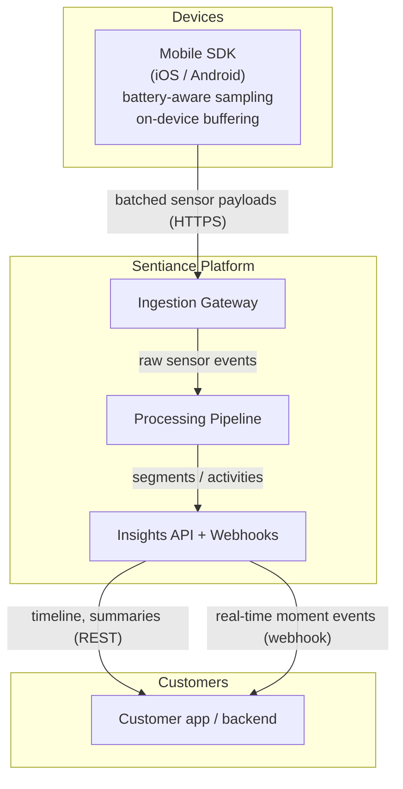
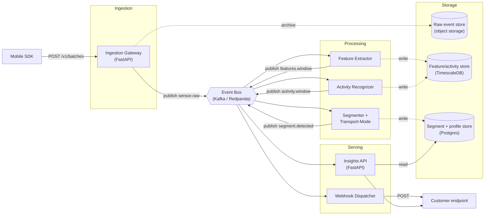
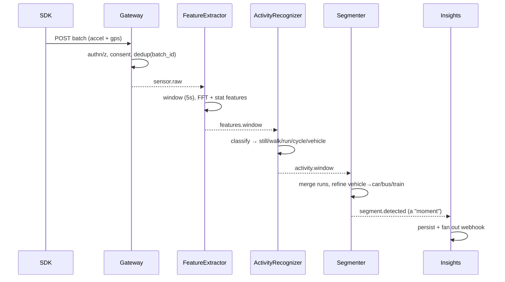
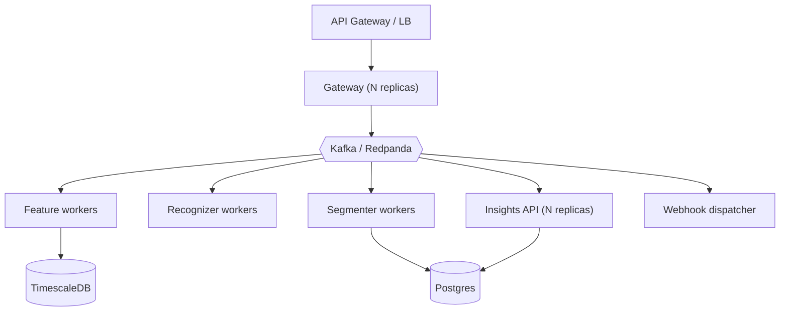

# Sentiance Platform Architecture

> A behavioral-intelligence platform that turns raw smartphone sensor data
> (accelerometer, gyroscope, GPS) into structured human-behavior insights —
> activities, trips, transport modes, and moments — while keeping raw signal
> handling privacy-first.

This document is the **source of truth** for how the platform is structured.
It is deliberately implementation-agnostic at the top (the "what" and "why")
and concrete at the bottom (schemas, topics, module map). The reference
implementation in this repo realizes the flagship **Activity & Transport-Mode**
vertical end-to-end.

---

## 1. Problem & goals

A phone emits a firehose of low-level, noisy, high-frequency signals. On their
own they mean nothing. The platform's job is to convert that firehose into a
small number of **high-value, semantically meaningful events**:

| Raw in                                   | Insight out                                  |
| ---------------------------------------- | -------------------------------------------- |
| 20–50 Hz accelerometer bursts            | "User was **running** 07:12–07:41"           |
| GPS fixes (lat/lon/speed/accuracy)       | "User took a **car** trip, 8.2 km, 14 min"   |
| Sequence of activities over a day        | A **timeline** of segments (a life pattern)  |

**Design goals**

1. **Ingest at scale, cheaply.** Batched, compressed, idempotent uploads.
2. **Decouple stages.** Each processing stage is independently deployable and
   scalable; stages communicate only through an event log.
3. **Model-swappable.** The activity classifier is a plugin behind a stable
   port — a heuristic today, a trained model tomorrow, no pipeline change.
4. **Runnable anywhere.** The *same* code runs in-process (tests/laptop) and on
   a real streaming stack (prod) via ports & adapters. No mocks in prod paths.
5. **Privacy-first.** Pseudonymous IDs, per-tenant isolation, consent enforced
   at ingestion, data minimization, and an on-device (edge) feature path.

---

## 2. System context (C4 — Level 1)



---

## 3. Container view (C4 — Level 2)



Every arrow labelled `publish`/consume is an **append to a durable topic**.
Stages never call each other directly — the bus is the only integration seam.

---

## 4. The pipeline, stage by stage



1. **Ingestion Gateway** — authenticates tenant + user, enforces consent,
   validates payload, stamps server-receive time, deduplicates by
   `(device_id, batch_id)`, publishes `sensor.raw`, and archives the raw batch
   to cold storage. Stateless and horizontally scalable.

2. **Feature Extractor** — consumes `sensor.raw`, resamples/windows the
   accelerometer magnitude into fixed windows (default **5 s**), and computes a
   feature vector per window: time-domain (mean, std, RMS, MAD, jerk,
   zero-crossing rate) and frequency-domain (dominant frequency, spectral
   energy, spectral entropy via FFT). Fuses GPS-derived features (speed,
   acceleration, straightness). Emits `features.window`.

3. **Activity Recognizer** — consumes `features.window`, runs the pluggable
   `Classifier` to produce a labelled `activity.window` with a confidence.
   The reference classifier is a transparent, testable heuristic; a trained
   model implementing the same `Classifier` protocol drops in unchanged.

4. **Segmenter + Transport-Mode** — consumes `activity.window`, coalesces
   consecutive same-label windows into **segments** (trips/stationary moments),
   applies hysteresis to avoid flapping, and for `vehicle` segments refines the
   transport mode (car / bus / train / tram) from the speed/stop profile.
   Emits `segment.detected`.

5. **Insights API + Webhooks** — persists segments, serves the per-user
   **timeline** and **daily summary**, and dispatches `segment.detected` to
   customer webhook endpoints in real time.

---

## 5. Key architectural decisions

Full records live in [`docs/adr/`](docs/adr). Summary:

| ADR | Decision | Why |
| --- | -------- | --- |
| [0001](docs/adr/0001-hexagonal-ports-and-adapters.md) | Hexagonal (ports & adapters) core | Same code runs in-memory (tests) and on Kafka+Postgres (prod); no prod mocks |
| [0002](docs/adr/0002-event-streaming-backbone.md) | Event log as the only inter-stage seam | Independent scaling, replay, backpressure, at-least-once + idempotency |
| [0003](docs/adr/0003-windowed-feature-extraction.md) | Fixed 5 s windows, features not raw into models | Stable model input, cheap, edge-computable, decouples sampling rate |
| [0004](docs/adr/0004-privacy-and-consent.md) | Pseudonymous IDs, consent-at-ingest, edge path | GDPR alignment, data minimization, raw signal never required downstream |

---

## 6. Data contracts

All events carry an envelope and are versioned. Canonical Pydantic models live
in [`sentiance/core/schemas.py`](sentiance/core/schemas.py).

**Topics**

| Topic               | Producer          | Key            | Payload            |
| ------------------- | ----------------- | -------------- | ------------------ |
| `sensor.raw`        | Gateway           | `device_id`    | `SensorBatch`      |
| `features.window`   | Feature Extractor | `device_id`    | `FeatureWindow`    |
| `activity.window`   | Activity Recognizer | `device_id`  | `ActivityWindow`   |
| `segment.detected`  | Segmenter         | `user_id`      | `Segment`          |

**Envelope (every message)**

```jsonc
{
  "event_id": "uuid",        // idempotency key
  "tenant_id": "acme",       // multi-tenant isolation
  "user_id": "u_9f...",      // pseudonymous
  "device_id": "d_31...",    // pseudonymous
  "occurred_at": "2026-07-14T07:12:03Z",
  "schema_version": 1
}
```

Partition key is `device_id` upstream (preserves per-device ordering for
windowing) and `user_id` at the segment layer (per-user timelines).

---

## 7. Module map (reference implementation)

Single installable package, cleanly layered — services are thin entrypoints
over the domain core.

```
sentiance/
  core/
    schemas.py            # all event/DTO models (the data contracts)
    config.py             # Settings (SENTIANCE_* env)
    bus/
      base.py             # EventBus port (publish/subscribe) + Message
      memory.py           # InMemoryEventBus  (tests / laptop)
      kafka.py            # KafkaEventBus     (prod; optional dep)
    repositories/
      base.py             # SegmentRepository port
      memory.py           # InMemorySegmentRepository
  features/
    extraction.py         # windowing + time/frequency feature computation
  recognition/
    classifier.py         # Classifier protocol + HeuristicActivityClassifier
    transport.py          # vehicle → car/bus/train refinement
    segmentation.py       # activity windows → segments (hysteresis)
  processing/
    pipeline.py           # wires bus consumers raw→features→activity→segment
    worker.py             # processing entrypoint
  ingestion/
    service.py            # ingest use-case (validate → publish → archive)
    app.py                # FastAPI gateway
  insights/
    service.py            # timeline / summary read models
    app.py                # FastAPI insights API + webhook fan-out
  simulation/
    generator.py          # synthetic sensor data (walk/run/drive) for demos+tests
  __main__.py             # dev runner (in-process end-to-end)
```

The **dependency rule** points inward: `core` depends on nothing; `features`,
`recognition` depend on `core`; services depend on the domain, never the
reverse. Swapping Kafka for the in-memory bus, or the heuristic for a trained
model, touches exactly one adapter and no domain code.

---

## 8. Deployment topology (prod)



- Consumer groups scale each stage independently by partition count.
- At-least-once delivery + idempotent writes (`event_id`) give effectively-once
  semantics at the persistence layer.
- Topic replay re-derives all downstream state after a model upgrade.

Local development uses the exact same services against
[`deploy/docker-compose.yml`](deploy/docker-compose.yml) (Redpanda + Postgres),
or fully in-process via `python -m sentiance` with the in-memory adapters.

---

## 9. Cross-cutting concerns

- **Privacy** — consent flags travel with every batch and are enforced at the
  gateway; downstream stages operate on pseudonymous IDs only; an edge path
  lets the SDK submit `features.window` directly so raw signal never leaves the
  device (see ADR-0004).
- **Multi-tenancy** — `tenant_id` on every event; row-level isolation in stores.
- **Observability** — structured logs keyed by `event_id`; per-stage lag and
  throughput are the primary SLOs.
- **Schema evolution** — additive, versioned payloads; `schema_version` gates
  consumers.

---

## 10. Roadmap beyond the flagship vertical

The flagship **Activity & Transport-Mode** vertical is implemented. The same
pipeline shape extends to:

- **Driving behavior** — harsh accel/brake/cornering, speeding, distraction,
  per-trip scores (a new consumer of `sensor.raw` + `segment.detected`).
- **Moments & places** — stationary segments → semantic venues; home/work/POI
  discovery from the segment timeline.
- **Behavioral profiles & segments** — daily/weekly life-pattern aggregation
  over the segment stream.

Each is an additional consumer group — no change to existing stages.
